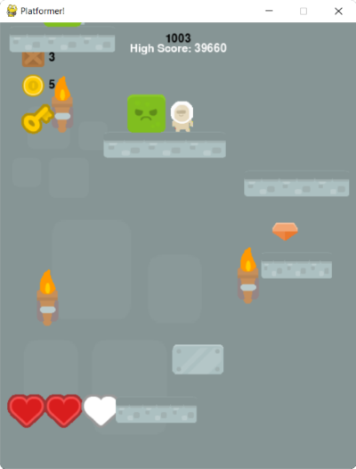

# **Platformer**
---
### Table of Contents
1. [What is **Platformer**?](#what-is-it)
2. [Screen Shots](#images)
3. [How To Use](#how-to-use)
---
### **Video Demo:** https://www.youtube.com/v/myvideo/
## What is it?
Lorem ipsum dolor sit amet, consectetur adipisicing elit, sed do eiusmod tempor incididunt ut labore et dolore magna aliqua. Ut enim ad minim veniam, quis nostrud exercitation ullamco laboris nisi ut aliquip ex ea commodo consequat. Duis aute irure dolor in reprehenderit in voluptate velit esse cillum dolore eu fugiat nulla pariatur. Excepteur sint occaecat cupidatat non proident, sunt in culpa qui officia deserunt mollit anim id est laborum.
## **Images:**
**Random Scene From The Game:-** 
 **Start Screen:-** 
 **Game Over Screen:-** 
 **Big Blast:-** 
 
## How To Use
You can use the arrow keys to move around `spacebar` can also be used to jump.
The game uses near real calculations for gravity, velocity, acceleration, etc.
---
Game Graphics By Kenney @ https://www.kenney.nl/
